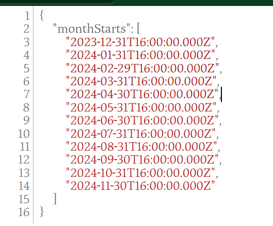

# Local Time API Service

基于 TypeScript 和 Express 构建的本地时间查询服务。

## 功能特点

- 支持根据经纬度查询时区信息
- 返回指定时间范围内的月份结束时间
- 使用 TypeScript 提供类型安全
- 使用 Make 管理项目构建

## 安装和运行

1. 安装依赖：
```bash
make install
```

2. 构建项目：
```bash
make build
```

3. 启动服务：
```bash
make start
```

## API 接口

### GET /months

查询指定时间范围内的月份结束时间。

**参数：**
- lon: 经度
- lat: 纬度
- from: 开始月份 (YYYY-MM)
- to: 结束月份 (YYYY-MM)

**示例请求：**
```
http://localhost:3000/months?lon=121.469176&lat=31.224361&from=2024-01&to=2024-12
```

**返回示例：**



## 技术栈

- TypeScript
- Express
- moment-timezone
- Make